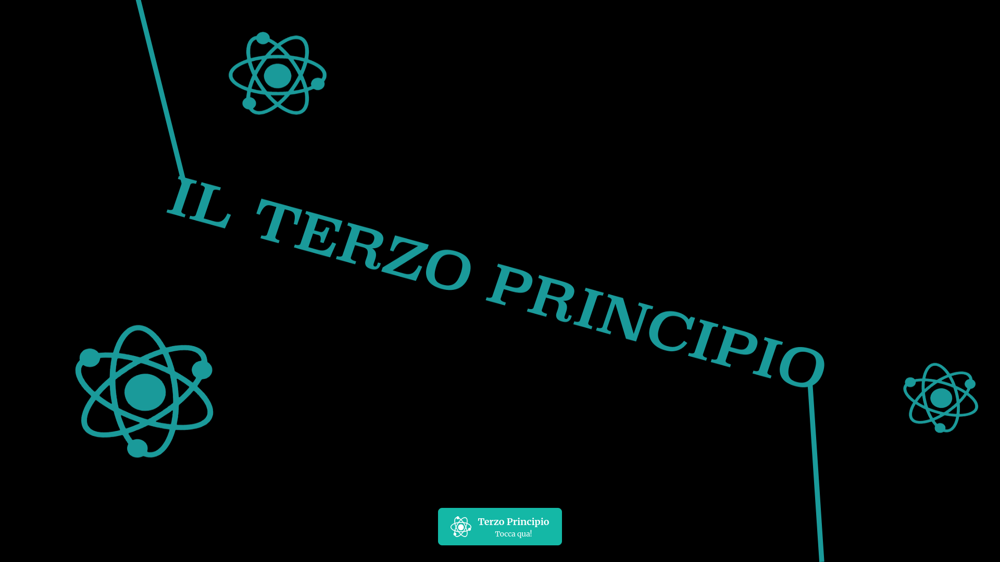
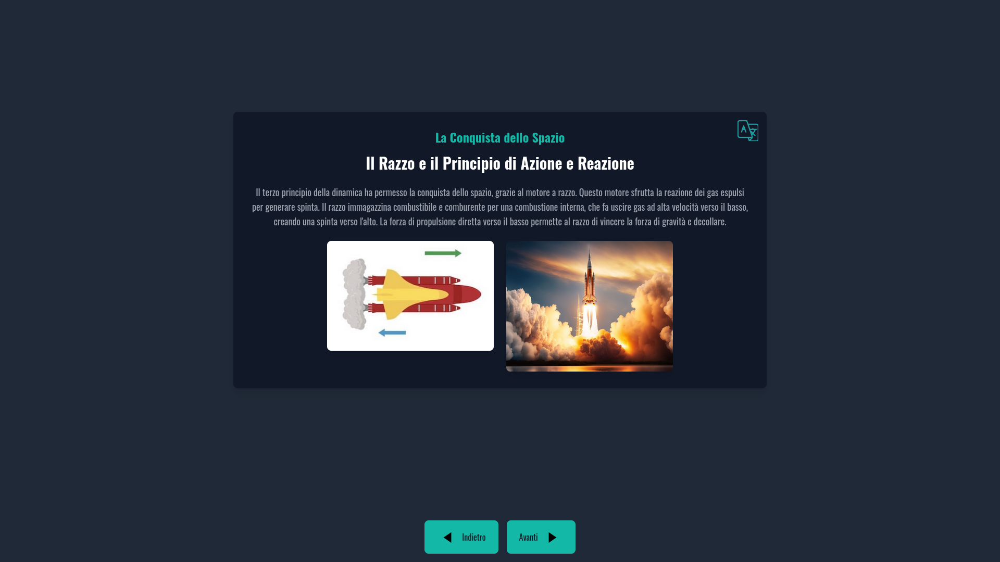
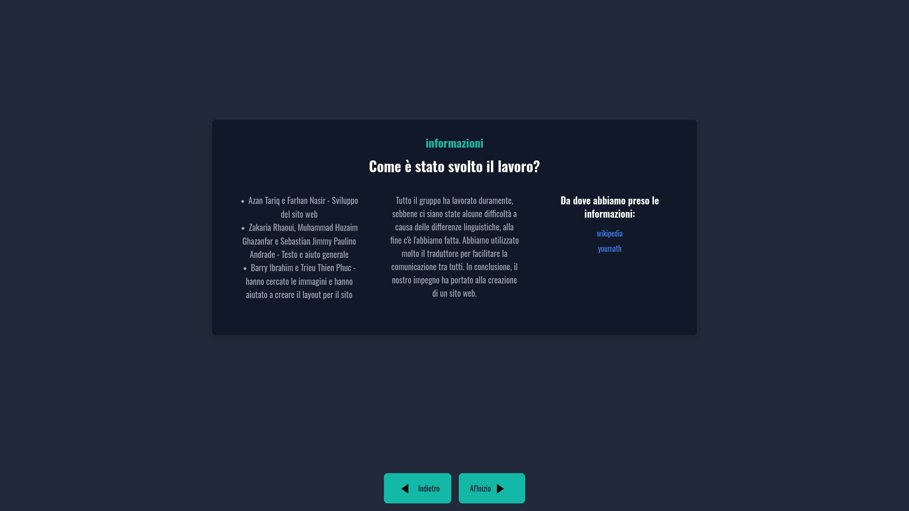

# [TerzoPrincipio](https://terzoprincipio.netlify.app/) (Archived school project)

This is the archived version of a school website I built in 2025 with a friend. The design, text, and Tailwind-based styling are preserved exactly as they were, right down to inline classes and all-Tailwind setup.
A website about Newtons third law, which means FAB = – FAB.

---

## Structure
- **/HTML:**
  - index.html
  - teoria-uno.html
  - esperimento-uno.html
    ... 
- **/pictures:**
  ... (List of all images used)

---

## Screenshots 

### Start of the site:

### Middle section / key content:

### End / Conclusion:

---

# Questions and Answers.

## How was the website made?

Originally the website was for a school project. We didnt want to use google slides so we made a website.
Me and my friend Azan made the structure and the code. The other 4 made the text and gave us support.
We used HTML and TAIlWIND. 

---

## Howd you get the website working and keeping it online?

Well this is where we ran in to an issue. We didnt have a server so we hosted the website on netlify.app. Yes a free website hoster.

---

## Why this version?

- To preserve the original visual layout—no redesign, just recall and retype.
- As a snapshot of my skills *back then* (tailwind-heavy, one-file style).
- To contrast later in the repo with a clean, revamped version (`main` or `v2` branch).

---

When I remade it, the result will be a cleaner, component-based version with better structure, animations, and maintainable code. Feel free to explore both to see how much I’ve grown.

---

## How to view

Open `index.html` in your browser like any static site—no build steps, no frameworks, just a snapshot of older days.
